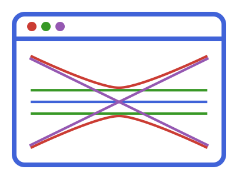

<div align="center">
  
</div>

# BeamletOpticsGUI.jl

[](https://stackenjoyer.github.io/BeamletOpticsGUI.jl/stable/)
[](https://stackenjoyer.github.io/BeamletOpticsGUI.jl/dev/)
[](https://github.com/StackEnjoyer/BeamletOpticsGUI.jl/actions/workflows/CI.yml?query=branch%3Amain)
[](https://codecov.io/gh/StackEnjoyer/BeamletOpticsGUI.jl)
[](https://github.com/JuliaTesting/Aqua.jl)

Interactive GUI for [BeamletOptics.jl](https://github.com/JuliaPhysics/BeamletOptics.jl): move the
components of an optical setup with the mouse and keyboard, and see the beams and detector signals
update live. BeamletOptics computes the physics and draws the components; this package arranges
them into an interactive window.

```julia
using GLMakie, BeamletOptics, BeamletOpticsGUI

m = RoundPlanoMirror(25e-3, 5e-3)
zrotate3d!(m, deg2rad(45))
translate3d!(m, [0, 0.1, 0])
pd = Detector(5e-3)
zrotate3d!(pd, -π / 2)
translate3d!(pd, [0.1, 0.1, 0])

gui = live_view(System([m, pd]), GaussianBeamlet([0.0, 0, 0], [0.0, 1, 0], 1e-6, 0.5e-3);
    layout = :app)
display(gui)
```

## Installation

BeamletOpticsGUI is installed from the General registry:

```julia
using Pkg
Pkg.add("BeamletOpticsGUI")
```

It needs BeamletOptics 0.13 (0.13.12 or newer) and a Makie backend, preferably GLMakie.

## Features

- `live_view`: a window with the 3D view, a detector view on the card of each detector (spot diagram, PSF or intensity), cards of
  the selected component, clip planes, measurements and camera tools, in a compact or an
  application layout, light or dark
- a component catalog and `add_component!`/`remove_component!` to add and remove components at runtime
- `kinematic_controls!` and `view_cube!` for own Makie scenes
- own panels, controls and tools (`add_panel!`, `add_controls!`, `add_tool!`) and cards for own
  component types (`card_rows`)

See the [documentation](https://stackenjoyer.github.io/BeamletOpticsGUI.jl/) and the agent skill
in `skills/beamletopticsgui/` (`BeamletOpticsGUI.install_agent_skill()`).
